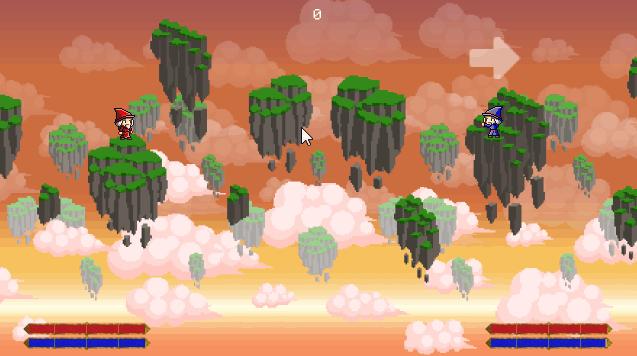

# Spellfight

It's a game about fight of two wizards. Spellfight.
Was written in two days, so the code is ugly, but the game is finished!

## Controls
* Player 1:
    * WASD to cast the spell.
    * Left ctrl or left shift to attack.
* Player 2:
    * Arrows to cast the spell.
    * Right ctrl or right shift to attack.
* F11 to toggle fullscreen.
* F3 to enable visual effects.

## Credits

